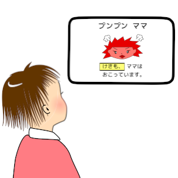
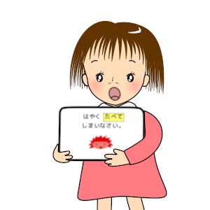

わたし　いちねんせいに　なったの。  

がっこう　だいすき。

でも &nbsp;きょうかしょを &nbsp;よもうとすると &nbsp;じが &nbsp;うごきだしちゃう！

こまっていると &nbsp;せんせいが &nbsp;タブレットを &nbsp;かしてくれました。  

きいろに　なった &nbsp;もじの　ところを &nbsp;タブレットが &nbsp;よんでくれます。

マルチメディア　デイジーって &nbsp;いうんですって。  

とっても &nbsp;よく &nbsp;わかるの。  

せんせい、 &nbsp;もっと &nbsp;よみたい！

